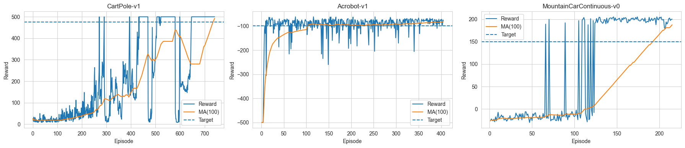

# Deep Reinforcement Learning - Assignment 3

## Training and Comparing Meta-Learning and Transfer-Learning using an Actor-Critic agent

## Introduction

Deep reinforcement learning algorithms usually require a large number of trials, derived from the need to re-collect large dataset and training from scratch per task. Intuitively, knowledge gained in learning one task should help to learn new, related tasks more quickly. Humans and animals are able to learn new tasks in just a few trials. Here we designed a reinforcement learning algorithm that leverages prior experience to figure out how to solve new tasks quickly. In recent literature, such methods are referred to as meta-reinforcement learning [Mishra et al. 2018, Finn et al. 2017, Wang et al. 2016, Duan et al. 2016].

## Assignment Structure

### Section 1: Training Individual Networks
In this section we implemented a one-step Actor-Critic algorithm on three control problems: CartPole-v1, Acrobot-v1, and MountainCarContinuous-v0.

**Technical Implementation:**
- **Unified Architecture**: All tasks use identical network dimensions (state_dim=6, action_dim=5) with input padding for smaller observation spaces and action masking for unused actions
- **MountainCar Discretization**: Converted continuous action space to 5 discrete actions using custom adapters
- **Reward Shaping**: Implemented a custom wrapper for MountainCar providing intermediate rewards:
  - Position bonuses (weight=10.0) for reaching new heights
  - Velocity bonuses (weight=1.0) for building momentum  
  - Large goal completion bonus (+100) for reaching the flag
- **Hyperparameter Tuning**: Used entropy_coef=0.10 for MountainCar (vs 0.01 for others) to reduce exploration after discovering successful strategies
- **Success Criteria**: Defined task-specific success metrics:
  - **CartPole**: Episode length ≥ 500 steps (full episode completion)  
    → Similar difficulty to MA_100 episodes ≥ 475 demand
  - **Acrobot**: Episode reward ≥ -100 (standard threshold)
  - **MountainCar**: Episode length < 999 steps (reaching flag before timeout)
- **Convergence Definition**: Target 95% success rate over moving average window of 100 episodes
- **Model Persistence**: Automatic saving of converged models using environment names (e.g., `models/CartPole-v1.pth`)

All agents converged within 1000-2000 episodes, demonstrating effective learning across diverse control tasks.




### Section 2: Fine-Tuning an Existing Model
Will Fine-tune models trained on one problem to apply to another. For pairs: Acrobot -> CartPole, CartPole -> MountainCar:
- Take the fully trained source model, reinitialize output layer weights.
- Train on the target task.
- Provide statistics on running time and iterations. Compare to Section 1 results. Did fine-tuning lead to faster convergence?

### Section 3: Transfer Learning
Will Implement a simplified Progressive Networks approach. For settings: {Acrobot, MountainCar} -> CartPole and {CartPole, Acrobot} -> MountainCar:
- Connect fully-trained source networks to the untrained target network (sources remain frozen).
- Connect hidden layers appropriately (top layers first, then lower if multiple).
- Train until convergence. Did transfer learning improve training? Provide statistics.

Important: Transfer learning can be tricky; document efforts even if not successful.

## Project Structure
```
Root/
├── src/
│   ├── adapters.py                     # Environment adapters for unified I/O and action discretization
│   ├── agent.py                        # Actor-Critic agent with save/load functionality
│   ├── ffnn.py                         # Feed-forward neural networks (PolicyNetwork, ValueNetwork)
│   ├── train.py                        # Training functions with success rate convergence
│   ├── training_utils.py               # Utilities for plotting and analysis
│   └── wrappers.py                     # Reward shaping wrappers (MountainCarRewardShaping)
├── mainColab.ipynb                     # Main notebook for training and evaluation
├── results/                            # Training outputs (plots, summaries)
├── models/                             # Saved model checkpoints (auto-saved on convergence)
├── requirements.txt                    # Python dependencies
└── README.md                           # This file
```

## Algorithms

### Actor-Critic
An online algorithm that updates the policy and value function at every step, rather than at the end of the episode.
- **Update Rule**: Uses the TD-error $\delta_t = R_{t+1} + \gamma V(s_{t+1}) - V(s_t)$ as the advantage estimate.
- **Critic**: Learns value function ($V(s)$) using TD learning.
- **Actor**: Updates policy using $\delta_t$ as the critic's evaluation of the action.
- **Entropy Regularization**: Encourages exploration.

### Transfer Learning Methods
- **Fine-Tuning**: Retrain a pre-trained model on a new task by reinitializing output layer.
- **Progressive Networks**: Connect multiple source networks to a target, freezing sources.

## Usage

Open `mainColab.ipynb` to run the training and evaluation pipeline.
The notebook covers:
1. Environment setup and adapters.
2. Training individual networks (Section 1).
3. Fine-tuning models (Section 2).
4. Transfer learning (Section 3).
5. Comparative analysis.
